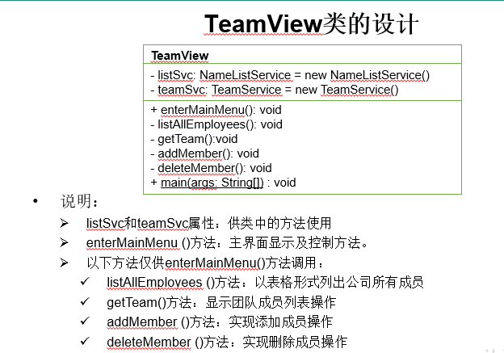

# JavaBasisProject3----开发团队调度软件

## 总体需求

- 模拟实现一个基于文本界面的《开发团队调度软件》
- 主要涉及的知识点
  - 类的继承性和多态性
  - 对象的值传递、接口
  - static和final修饰符
  - 特殊类的使用：包装类、抽象类、内部类
  - 异常处理

## 要实现的功能

- 软件启动时，根据给定的数据创建公司部分成员列表（数组）——<font color = 'red'>给定的数据是什么？</font>
- 根据菜单提示，基于现有的公司成员（一开始就有数据），组建一个开发团队以开发一个新的项目
  - 组建过程：将成员插入到团队中，从团队中删除某成员，列出团队现有成员的列表
  - 开发团队成员：架构师、设计师、程序员

## 界面展示

### 主界面

当软件运行时，主界面显示公司成员的列表

```

-------------------------------------开发团队调度软件--------------------------------------

ID     姓名      年龄    工资         职位      状态      奖金        股票     领用设备
 1    马 云      22      3000.0
 2    马化腾     32      18000.0    架构师     FREE    15000.0      2000    联想T4(6000.0)
 3    李彦宏     23      7000.0     程序员     FREE                         戴尔(NEC17寸)
 4    刘强东     24      7300.0     程序员     FREE                         戴尔(三星 17寸)
 5    雷军       28      10000.0    设计师     FREE    5000.0               佳能 2900(激光)
 ……
----------------------------------------------------------------------------------------------
1-团队列表  2-添加团队成员  3-删除团队成员 4-退出   请选择(1-4)： _

```

#### 思考

这些数据应该是保存到一个员工列表里面，员工列表是一个数组，数组的每个元素是一个员工的信息，然后主界面就是listAllStaffs(), 然后下面那一列。

### 添加团队成员

从列表中添加指定成员（通过ID）到开发团队。

```
1-团队列表  2-添加团队成员  3-删除团队成员  4-退出   请选择(1-4)：2

---------------------添加成员---------------------
请输入要添加的员工ID：2
添加成功
按回车键继续...
```

添加成功后，按回车键将重新显示主界面。

开发团队人员组成要求：最多一名架构师、最多两名设计师，最多三名程序员

#### 思考

1、除了员工列表，还有一个开发团队列表。

2、怎么设置要添加的成员是架构师还是设计师还是程序员呢

3、如何知道是添加到哪一个团队呢？（TeamID）

#### 添加团队人员失败

```
如果添加操作因某种原因失败，将显示类似以下信息（失败原因视具体原因而不同）：
1-团队列表  2-添加团队成员  3-删除团队成员 4-退出   请选择(1-4)：2

---------------------添加成员---------------------
请输入要添加的员工ID：2
添加失败，原因：该员工已是某团队成员
按回车键继续...
```

```
失败信息包含以下几种：
成员已满，无法添加
该成员不是开发人员，无法添加
该员工已在本开发团队中
该员工已是某团队成员 
该员正在休假，无法添加
团队中至多只能有一名架构师
团队中至多只能有两名设计师
团队中至多只能有三名程序员

```

### 删除团队成员

当选择“删除团队成员”菜单时，将执行从开发团队中删除指定（通过TeamID）成员的功能：

```
1-团队列表  2-添加团队成员  3-删除团队成员 4-退出   请选择(1-4)：3

---------------------删除成员---------------------
请输入要删除员工的TID：1
确认是否删除(Y/N)：y
删除成功
按回车键继续...

```

 删除成功，按回车键将重新显示主界面

### 团队列表

当选择“团队列表”菜单时，将列出开发团队中的现有成员，例如：

```
1-团队列表  2-添加团队成员  3-删除团队成员 4-退出   请选择(1-4)：1

--------------------团队成员列表---------------------

TDI/ID  姓名    年龄      工资       职位      奖金        股票
 2/4     刘强东   24      7300.0    程序员
 3/2     马化腾   32      18000.0  架构师   15000.0  2000
 4/6     任志强   22      6800.0    程序员
 5/12   杨致远   27      600.0      设计师   4800.0
-----------------------------------------------------
```

#### 思考

注意这里的第一列是TeamID和ID

### 软件设计

模块构成

- TeamView: 负责菜单的显示和处理用户操作
- service
  - NameListService: 员工列表的管理
  - TeamService: 团队列表的管理
  - TeamException:团队增删的一些异常管理
- domain
  - 员工及其子类的管理
    - Employee
      - Programmer(程序员)
        - Designer(设计师)
          - Architect(架构师)
  - 领用设备：用接口来实现
    - 不同的设备实现设备接口，每个设备的description不一样，所以使用
    - 因为这里的设备不只是一类的，比如公司里的设备有打印机、笔记本电脑、台式电脑。这几个严格意义上说不是一类的，而他们都有被领用这个操作，所以用接口来实现而不是继承

## 实现过程

### 第一步：创建项目基本组件

- 创建TeamSchedule项目,按照设计要求，创建所有包
- 将项目提供的几个类复制到相应的包中
  -  (view包中：TSUtility.java;  service包中：Data.java)

- 按照设计要求，在domain包中，创建Equipment接口及其各实现子类代码

- 按照设计要求，在domain包中，创建Employee类及其各子类代码

- 检验代码的正确性

 

 

 

### 第二步：实现service包中的类

- 按照设计要求编写NameListService类
- 在NameListService类中临时添加一个main方法中，作为单元测试方法。
- 在方法中创建NameListService对象，然后分别用模拟数据调用该对象的各个方法，以测试是否正确。

 注：测试应细化到包含了所有非正常的情况，以确保方法完全正确。

- 重复1-3步，完成TeamService类的开发

#### nameListService类


 

 

#### TeamService类

关于团队

 

 

### 第三步：实现View包中的类

- 按照设计要求编写TeamView类，逐一实现各个方法，并编译
- 执行main方法中，测试软件全部功能

 

#### 遇到的问题

##### 接口不知道怎么写

直接在接口内声明需要被重写的方法即可

 

##### Status 员工状态的封装

```
public class Status {
    private final String NAME;
    private Status(String name) {
        this.NAME = name;
    }
    public static final Status FREE = new Status("FREE");
    public static final Status VOCATION = new Status("VOCATION");
    public static final Status BUSY = new Status("BUSY");
    public String getNAME() {
        return NAME;
    }
    @Override
    public String toString() {
        return NAME;
    }
} 
```


##### 怎么根据这个Data的数据来写nameListService类

```
package service;

public class Data {
    public static final int EMPLOYEE = 10;
    public static final int PROGRAMMER = 11;
    public static final int DESIGNER = 12;
    public static final int ARCHITECT = 13;

    public static final int PC = 21;
    public static final int NOTEBOOK = 22;
    public static final int PRINTER = 23;

    //Employee  :  10, id, name, age, salary
    //Programmer:  11, id, name, age, salary
    //Designer  :  12, id, name, age, salary, bonus
    //Architect :  13, id, name, age, salary, bonus, stock
    public static final String[][] EMPLOYEES = {
            {"10", "1", "马云", "22", "3000"},
            {"13", "2", "马化腾", "32", "18000", "15000", "2000"},
            {"11", "3", "李彦宏", "23", "7000"},
            {"11", "4", "刘强东", "24", "7300"},
            {"12", "5", "雷军", "28", "10000", "5000"},
            {"11", "6", "任志强", "22", "6800"},
            {"12", "7", "柳传志", "29", "10800","5200"},
            {"13", "8", "杨元庆", "30", "19800", "15000", "2500"},
            {"12", "9", "史玉柱", "26", "9800", "5500"},
            {"11", "10", "丁磊", "21", "6600"},
            {"11", "11", "张朝阳", "25", "7100"},
            {"12", "12", "杨致远", "27", "9600", "4800"}
    };

    //如下的EQIPMENTS数组与上面的EMPLOYEES数组元素一一对应
    //PC      :21, model, display
    //NoteBook:22, model, price
    //Printer :23, type, name
    public static final String[][] EQUIPMENTS = {
            {},
            {"22", "联想T4", "6000"},
            {"21", "戴尔", "NEC17寸"},
            {"21", "戴尔", "三星 17寸"},
            {"23", "激光", "佳能 2900"},
            {"21", "华硕", "三星 17寸"},
            {"21", "华硕", "三星 17寸"},
            {"23", "针式", "爱普生20K"},
            {"22", "惠普m6", "5800"},
            {"21", "戴尔", "NEC 17寸"},
            {"21", "华硕","三星 17寸"},
            {"22", "惠普m6", "5800"}
    };
}

```


## 总结感想

1、先分析有哪些类

2、不同的类放在哪些模块。比如这个项目：关于界面展示和操作、关于实体、关于列表

3、搭框架：每个类的属性和方法框架搭好（输入输出什么的）

4、填充方法以及一些数据类型的设计